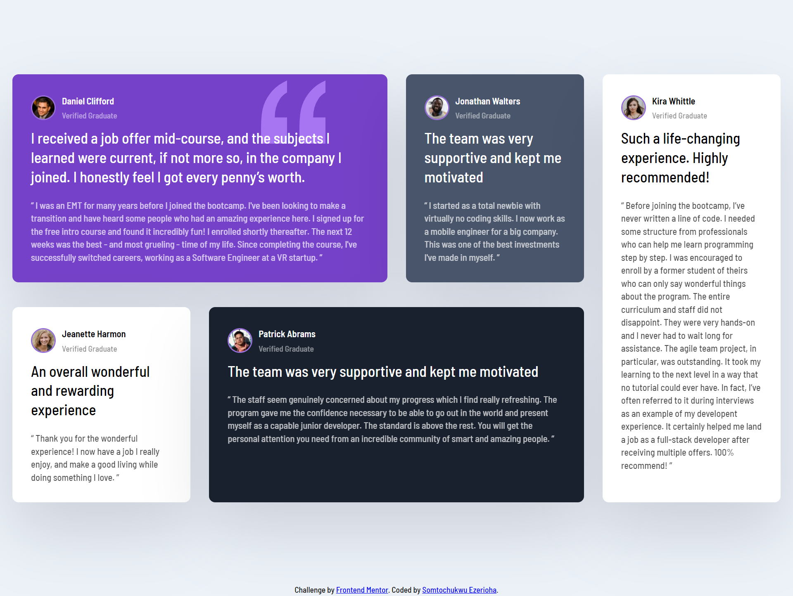

# Frontend Mentor - Testimonials grid section solution

This is a solution to the [Testimonials grid section challenge on Frontend Mentor](https://www.frontendmentor.io/challenges/testimonials-grid-section-Nnw6J7Un7). Frontend Mentor challenges help you improve your coding skills by building realistic projects. 

## Table of contents

- [Overview](#overview)
  - [The challenge](#the-challenge)
  - [Screenshot](#screenshot)
  - [Links](#links)
- [My process](#my-process)
  - [Built with](#built-with)
  - [What I learned](#what-i-learned)
  - [Useful resources](#useful-resources)
- [Author](#author)

## Overview

### The challenge

Users should be able to:

- View the optimal layout for the site depending on their device's screen size

### Screenshot

### Links

- Solution URL: [GitHub](https://github.com/somto96/Testimonial-grid-section-main)
- Live Site URL: [Testimonial Grid Section](https://testimonial-grid-section-main-nine.vercel.app/)

## My process
### Built with

- Semantic HTML5 markup
- CSS custom properties
- Flexbox
- CSS Grid

### What I learned
I had a better understanding of CSS Grid and pseudo-classes like :nth-of-type(). It also helped me remember some HTML5 tags like header and footer. I tend to forget about tags like header, footer, nav etc. during development. I always used a lot of div tags but this challenge was an eye opener. 

### Useful resources
- [W3Schools](https://www.w3schools.com) - It helped me out with some of my CSS issues during development.

## Author

- Website - [Somtochukwu Ezerioha](https://somto96.github.io/Somtochukwu-Ezerioha/)
- Frontend Mentor - [@somto96](https://www.frontendmentor.io/profile/somto96)

